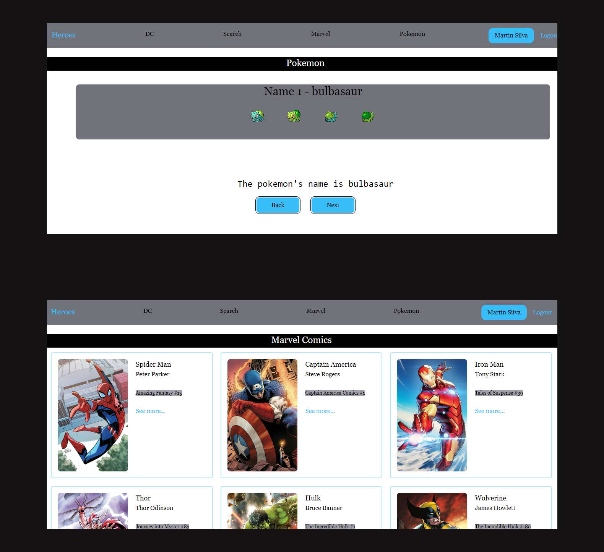

## Aplicación con React

### Descripción

Este proyecto es una aplicación web de una sola página (SPA) construida con React y JavaScript, utilizando la herramienta de desarrollo Yarn Create Vite. La aplicación permite interactuar con personajes de Marvel en varias páginas y consume una API de Pokémon.

### Tecnologías Utilizadas

- **React.js**: Biblioteca de JavaScript para construir interfaces de usuario.
- **React Router Dom**: Para manejar la navegación entre las diferentes secciones de la aplicación, incluyendo rutas privadas y públicas.
- **tailwindcss**: Framework de utilidades CSS para estilizar rápidamente los elementos HTML.
- **query-string**: Para manejar query strings en las URLs, enviando información adicional al servidor en pares clave-valor.

### Estructura del Proyecto

src/
├── auth/
│   └── login.js             # Archivos relacionados con la autenticación
├── heroes/
│   ├── components/
│   │   └── HeroCard.js      # Componentes reutilizables, como las tarjetas de héroes
│   ├── data/
│   │   └── heroes.js        # Array que contiene todos los héroes
│   ├── helpers/
│   │   └── filterHeroes.js  # Funciones de ayuda para filtrar héroes por id, nombre y publisher
│   ├── pages/
│   │   └── HeroPage.js      # Diferentes páginas accesibles desde la barra de navegación
│   └── routes/
│       └── HeroRoutes.js    # Definición de rutas relacionadas con héroes
├── hooks/
│   └── useCustomHook.js     # Hooks personalizados reutilizables
├── router/
│   └── AppRouter.js         # Configuración de rutas públicas y privadas
├── ui/
│   ├── components/
│   │   └── Navbar.js        # Componentes de la interfaz de usuario, como la barra de navegación
└── main.js                  # Punto de entrada de la aplicación

### Uso

1- Instalar vite con yar : yarn create vite my-vue-app
2-Instalar dependencias: yarn install
3-Ejecuta la aplicación: yarn dev
Página de inicio : Accesible en la URL raíz ( http://localhost:3000).

   

